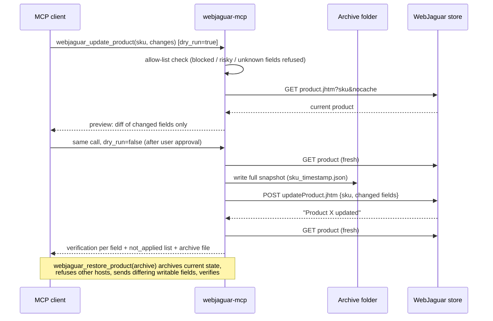

# Product write flow

```mermaid
sequenceDiagram
    participant C as MCP client
    participant S as webjaguar-mcp
    participant A as Archive folder
    participant W as WebJaguar store

    C->>S: webjaguar_update_product(sku, changes) [dry_run=true]
    S->>S: allow-list check (blocked / risky / unknown fields refused)
    S->>W: GET product.jhtm?sku&nocache
    W-->>S: current product
    S-->>C: preview: diff of changed fields only
    C->>S: same call, dry_run=false (after user approval)
    S->>W: GET product (fresh)
    S->>A: write full snapshot (sku_timestamp.json)
    S->>W: POST updateProduct.jhtm {sku, changed fields}
    W-->>S: "Product X updated"
    S->>W: GET product (fresh)
    S-->>C: verification per field + not_applied list + archive file
    Note over C,S: webjaguar_restore_product(archive) archives current state,<br/>refuses other hosts, sends differing writable fields, verifies
```
